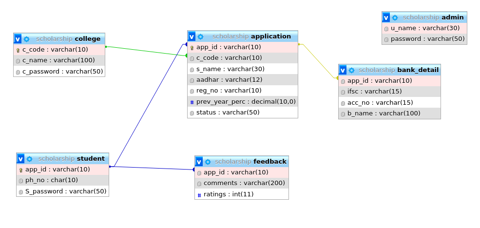

# Scholarship Management System
A Scholarship Portal, where
* **Student** applies for the scholarship
* **College** verifies the student's applications belonging to that college
* **Admin** Sanctions the Scholarship to the applications verified by college 

## Schema


## Requirements
* Xampp

## Set-up on your local machine
start xampp
```
/opt/lampp/xampp start
```
---
Extract the code in /opt/lampp/htdocs
```
cd /opt/lampp/htdocs
git clone https://github.com/sonydotgit/scholarship
```
---
Create new database in phpmyadmin named 'scholarship' and import database/scholarship.sql
```
firefox localhost/phpmyadmin
```
---
Fireup the browser and go to index.php
```
firefox localhost/scholarship/index.php
```
## Issues
* After verifying/declining in c_verify.php, user gets redirected to index.php which requires the user to login again to verify/decline other applications.
* a_app.php can be accessed directly by entering the url [ http://localhost/scholarship/a_app.php ]